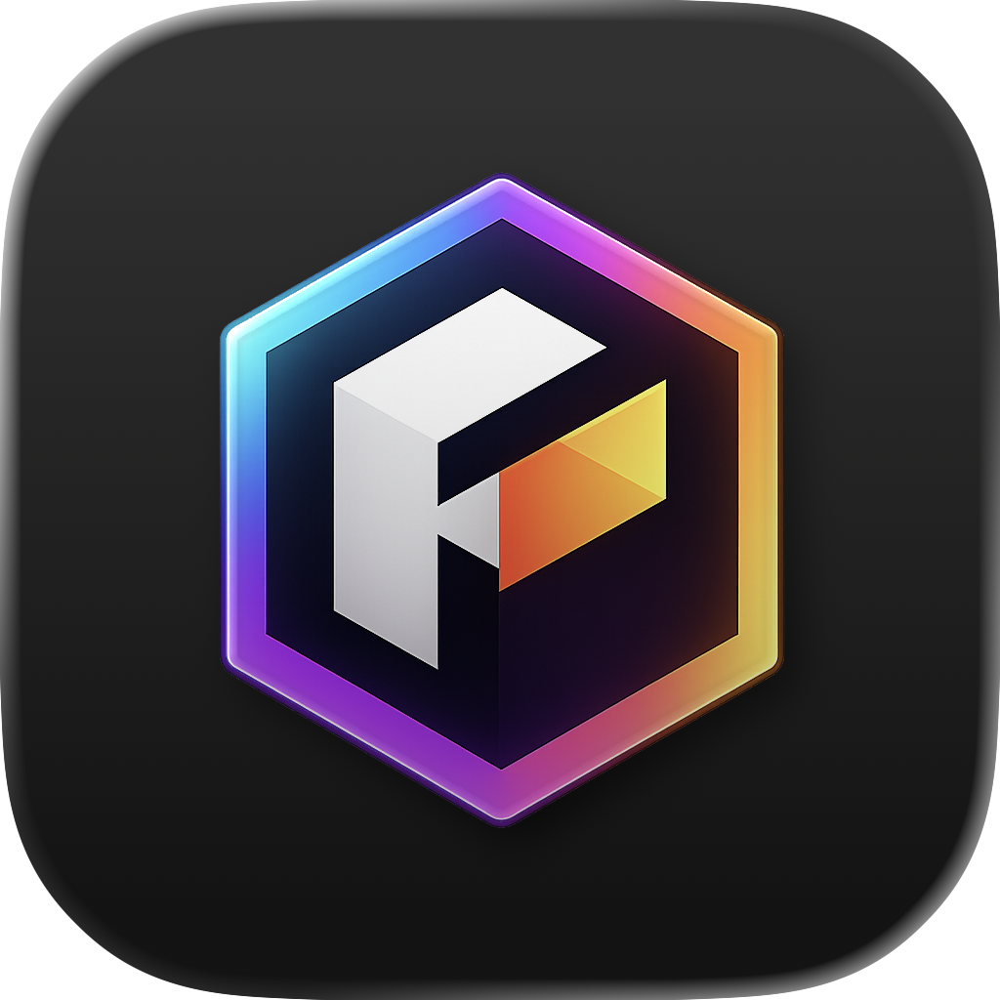
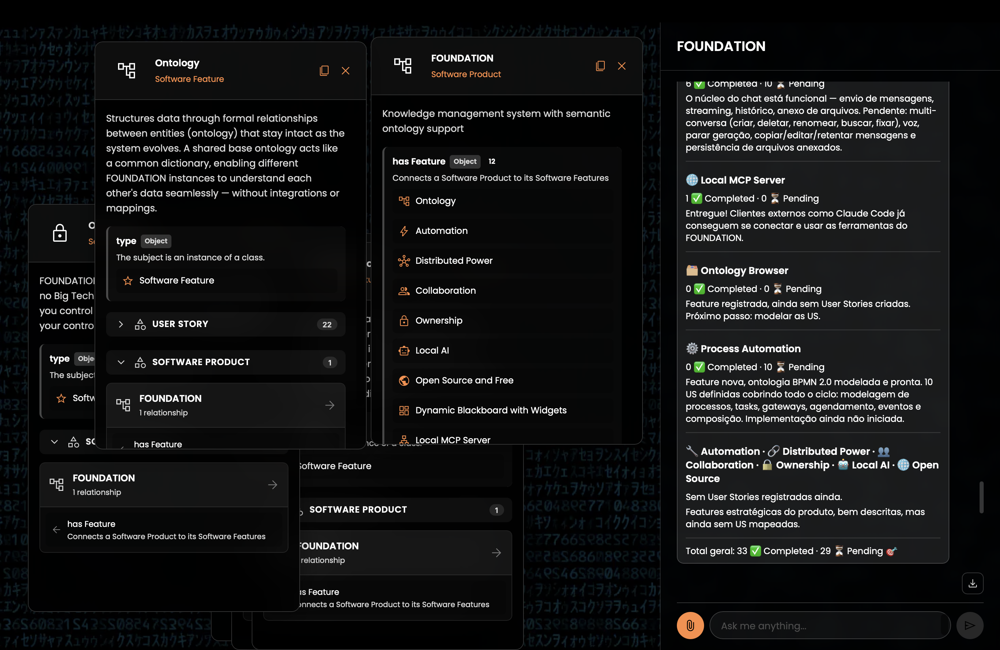

# FOUNDATION

<p align="center">
  
</p>



**Version 0.18.1** — AI-powered ontology management system with long-term memory

[](LICENSE)
[](https://github.com/danielterra/FOUNDATION/blob/main/CHANGELOG.md)

> **Status:** alpha. Prebuilt installers available — see [Download](#download) below.

## Features

Status reflete o registro autoritativo no próprio FOUNDATION (`foundation:SoftwareFeature` instances).

Legend: ✅ stable · 🚧 in development · 🛣️ planned

### Stable

- ✅ **Camera Vision** — optionally captures a webcam photo on each message send, extracting facial expression and body language context to enrich long-term conversation memory.
- ✅ **Calculated Fields** — read-only properties whose values are automatically computed from formulas referencing other instance properties, with cascading recalculation on change.
- ✅ **Dynamic Blackboard with Widgets** — visual canvas where multiple widgets display entities and their relationships simultaneously, providing rich interactive context beyond text.
- ✅ **Integrated AI Chat** — built-in AI chat interface with full real-time access to the user's personal knowledge base, persistent across sessions and deeply integrated with the ontology.
- ✅ **Local AI** — bundled `llama-cpp` runtime for running models entirely on-device. Cloud (Claude API) is the default for power users; the local model option is fully wired up and ready to use.
- ✅ **Local MCP Server** — exposes a local Model Context Protocol server so external AI clients (e.g. Claude Code) can use the same memory and tools as the internal assistant.
- ✅ **Open Source and Free** — released under GNU AGPL-3.0: no vendor lock-in, no subscriptions, no SaaS extraction. Forks must stay free.
- ✅ **Ownership** — runs entirely on the user's own machine with no external servers required, ensuring full data ownership and control.
- ✅ **Settings** — settings panel for viewing and editing user preferences (language, locale, AI model, theme) stored as typed `SoftwareSetting` instances.
- ✅ **Subconscious** — automatic background memory mechanism that surfaces 5–10 relevant ontology entities as scored chips on every user message, enriching AI context without explicit search.
- ✅ **Task Management** — first-class tasks with status, dependencies, and links into automation processes and AI agents.

### In development

- 🚧 **Automation** — BPMN 2.0-based workflow engine that lets users and the AI model schedule and execute automated multi-step processes triggered by timers or internal events.
- 🚧 **Ontology** — formal relationships between entities via a shared base ontology that keeps data meaningful and interoperable as the system evolves. Core works; vocabulary is still expanding.

### Planned

- 🛣️ **Collaboration** — multi-user workflows on top of the immutable store, with conflict-free merging.
- 🛣️ **Distributed Power** — peer-to-peer sync between FOUNDATION instances on different machines.
- 🛣️ **External AI Providers** — pluggable backends beyond Claude (OpenAI, local OpenAI-compatible servers, etc.).
- 🛣️ **Integrations** — first-party connectors for common external services.
- 🛣️ **System Inspector** — visualizer for processes, automation runs, and queue state.

## Download

Download the latest release from the [GitHub Releases page](https://github.com/danielterra/FOUNDATION/releases/latest):

| Platform | File to download | Notes |
|----------|-----------------|-------|
| **macOS** (Apple Silicon) | `FOUNDATION_x.x.x_aarch64.dmg` | Open the `.dmg`, drag FOUNDATION to Applications |
| **Windows** | `FOUNDATION_x.x.x_x64-setup.exe` | Run the installer (recommended) |
| **Windows** (alternative) | `FOUNDATION_x.x.x_x64_en-US.msi` | MSI package for enterprise/group policy |
| **Linux** (most distros) | `FOUNDATION_x.x.x_amd64.AppImage` | `chmod +x` then run — no install needed |
| **Linux** (Debian/Ubuntu) | `FOUNDATION_x.x.x_amd64.deb` | `sudo dpkg -i FOUNDATION_*.deb` |
| **Linux** (Fedora/RHEL) | `FOUNDATION-x.x.x-1.x86_64.rpm` | `sudo rpm -i FOUNDATION-*.rpm` |

> **macOS note:** On first launch, macOS may show a security warning because the app is not notarized yet. Go to **System Settings → Privacy & Security** and click **Open Anyway**.

## Quick Start

1. **Download and install** FOUNDATION for your platform (see [Download](#download) above).
2. **Pick a model** in the in-app settings:
   - Cloud: configure a Claude API key from [console.anthropic.com](https://console.anthropic.com/) — best quality and longest context.
   - Local: use the bundled `llama-cpp` runtime — no API key required; quality and speed depend on your hardware.
3. **Start chatting** with an AI assistant that remembers everything you tell it.

### Build from source

Prefer to build yourself? You'll need Node.js 20+, the Rust toolchain (via [rustup](https://rustup.rs/)), and the Tauri 2 system dependencies for your OS. Full list: [Development Guide → Prerequisites](docs/development.md#prerequisites).

```bash
git clone https://github.com/danielterra/FOUNDATION.git
cd FOUNDATION
npm install
npm run tauri        # first run compiles Rust — 5–15 min
```

## MCP Server

FOUNDATION exposes a local [Model Context Protocol](https://modelcontextprotocol.io) server that starts automatically when the app is running. Two endpoints are available:

| Endpoint | Port | TLS | Use case |
|----------|------|-----|----------|
| `http://127.0.0.1:47178/mcp` | 47178 | No | Claude Code, local clients |
| `https://127.0.0.1:47177/mcp` | 47177 | Yes (self-signed) | Clients that require HTTPS |

> **Important:** Both endpoints are localhost-only. Cloud-based AI services (e.g. Claude.ai Cowork) connect from Anthropic's servers and cannot reach a local address — they require a publicly accessible URL. To expose FOUNDATION remotely, use a tunnel such as `ngrok http 47178`.

### Claude Code

Add to `~/.claude.json` under the `mcpServers` key:

```json
{
  "mcpServers": {
    "foundation": {
      "type": "http",
      "url": "http://127.0.0.1:47178/mcp"
    }
  }
}
```

### Claude Desktop (Windows)

Claude Desktop on Windows requires [`mcp-remote`](https://www.npmjs.com/package/mcp-remote) as a proxy because it spawns MCP servers as local processes. Add to `%APPDATA%\Claude\claude_desktop_config.json`:

```json
{
  "mcpServers": {
    "foundation": {
      "command": "C:\\Program Files\\nodejs\\npx.cmd",
      "args": [
        "-y",
        "mcp-remote",
        "https://127.0.0.1:47177/mcp",
        "--transport",
        "http-only"
      ],
      "env": {
        "NODE_TLS_REJECT_UNAUTHORIZED": "0",
        "APPDATA": "C:\\Users\\<username>\\AppData\\Roaming\\"
      }
    }
  }
}
```

### Claude Desktop (macOS)

Add to `~/Library/Application Support/Claude/claude_desktop_config.json`:

```json
{
  "mcpServers": {
    "foundation": {
      "command": "npx",
      "args": [
        "-y",
        "mcp-remote",
        "https://127.0.0.1:47177/mcp",
        "--transport",
        "http-only"
      ],
      "env": {
        "NODE_TLS_REJECT_UNAUTHORIZED": "0"
      }
    }
  }
}
```

Restart the client after editing. FOUNDATION must be running for the tools to be available.

## Documentation

| Document | Description |
|----------|-------------|
| [Widget System](docs/widgets.md) | How the Dynamic Blackboard works, available widget types, and how to implement new ones |
| [Automation System](docs/automation.md) | BPMN process engine, task types, trigger mechanisms, connectors, and AI agent tasks |
| [Development Guide](docs/development.md) | Architecture layers, running the project, database structure, and debugging |

---

## A SOLID FOUNDATION FOR FREEDOM

FOUNDATION reimagines how anyone — not just developers — can manage, automate, and derive knowledge from their data. Your computer. Your data. Your rules. No Big Tech gatekeepers.

### ONTOLOGY

What if you could receive data from other systems natively, without integrations or mappings? FOUNDATION structures your data through ontology — formal relationships between entities that stay intact as your system evolves. A shared base ontology acts like a common dictionary, enabling different FOUNDATION instances to understand each other's data seamlessly.

### AUTOMATION

What if your data could act on its own? FOUNDATION reacts to every change with real automation. Connect to APIs, orchestrate multi-step processes, and trigger complex workflows without manual intervention. Your data becomes a living, responsive system.

### DISTRIBUTED POWER 🛣️ *(roadmap)*

What if you could scale without begging cloud providers? The vision is for FOUNDATION instances on different machines to synchronize peer-to-peer — your laptop, a spare machine, a friend's server, even a cloud VM if you want — each node contributing storage and processing, together acting as one resilient system. *Multi-device synchronization is not yet implemented.* Today, FOUNDATION runs on a single machine; the immutable Datomic-style store was designed with distributed reconciliation in mind, but the sync layer is future work.

### COLLABORATION 🛣️ *(roadmap)*

What if working together didn't mean conflicts and overwrites? FOUNDATION's immutable, Datomic-style store is conflict-free by design — nothing is altered, new facts are stored, history is immutable, and every change is traceable. The foundation is in place; the **multi-user collaboration layer on top of it is future work**. When information from different sources diverges, the model lets you choose which source to trust.

### OWNERSHIP

What if you could own and control your data? FOUNDATION runs locally on your own computer — no big Tech servers required. You own your data, you control your tools, and everything stays under your control.

### LOCAL AI

What if you had intelligent assistance without subscriptions or external services? FOUNDATION includes an efficient local AI that helps you build, analyze, and automate — solving most problems without ever leaving your machine or hiring external services. Private, fast, and always available.

### OPEN SOURCE AND FREE

What if software worked for humanity instead of shareholders? FOUNDATION is open source under the **GNU AGPL-3.0** — no corporation owns it, no vendor locks you in, no subscription extracts rent from your work, and no SaaS provider can fork it into a closed cloud product. Built by the community, for everyone. These ideas only benefit society when they're free, shared, and owned collectively by all of us (humans and our robot friends 🤖).

**This is not just software. This is a statement:** Your data is not a commodity. Your computing power is not something to be rented back to you. Your freedom should not require a subscription.

---

## Why we need FOUNDATION?

### The Spreadsheet Dilemma

Spreadsheets are the most popular software in the world. An estimated 1+ billion people use Excel alone[^1], with over 100 million professionals listing it as a core skill[^2]. Businesses of all sizes — from small startups to Fortune 500 companies — depend on spreadsheets for critical operations: 72% of enterprises use them for financial modeling and business intelligence[^3], and over 90% of administrative and managerial jobs require spreadsheet proficiency[^4].

Yet spreadsheets have fundamental limits that make them fragile and difficult to scale:

- **Weak data relationships**: No proper foreign keys, no referential integrity — relationships are just cell references that break when rows move or sheets are reorganized
- **No reactive automation**: Changes don't trigger workflows; there's no event system to automate responses when data changes
- **No validation or constraints**: Anyone can type anything anywhere; there's no way to enforce data types, required fields, or business rules
- **Manual and error-prone**: Copy-paste operations, formula mistakes, and accidental deletions happen constantly with no safeguards
- **Limited scalability**: Performance degrades severely with size; hitting row/column limits breaks critical systems
- **No proper querying**: You can't ask complex questions across multiple sheets or perform relational queries without building elaborate, brittle formulas
- **Flat structure**: Everything lives in rows and columns; you can't model hierarchies, graphs, or complex entity relationships naturally

**And when they fail, the consequences are serious:** JP Morgan Chase lost $6.2 billion due to a copy-paste error in a risk model[^5]. TransAlta Corp lost $24 million when misaligned rows caused bids to match wrong contracts[^6]. Fidelity Investments made a $2.6 billion accounting error from a missing minus sign[^7]. During the COVID-19 pandemic, Public Health England lost track of 15,841 positive cases because Excel hit its row limit[^8]. Studies show that 88% of all spreadsheets contain serious errors[^9] — yet businesses have no better alternative for the flexibility they need.

[^5]: [JPMorgan "London Whale" Excel error - Dear Analyst](https://www.thekeycuts.com/dear-analyst-38-breaking-down-an-excel-error-that-led-to-six-billion-loss-at-jpmorgan-chase/)
[^6]: [TransAlta $24M loss - Excel Disasters](https://sheetcast.com/articles/ten-memorable-excel-disasters)
[^7]: [Fidelity $2.6B error - Biggest Excel Mistakes](https://blog.hurree.co/8-of-the-biggest-excel-mistakes-of-all-time)
[^8]: [COVID-19 data loss - Spreadsheet Disasters](https://gridfox.com/blog/5-spreadsheet-disasters-that-prove-their-risk/)
[^9]: [88% error rate - Wall of Shame for Excel Errors](https://www.solving-finance.com/post/the-wall-of-shame-for-the-worst-excel-errors)

[^1]: [Senacea - How many people use Excel?](https://www.senacea.co.uk/post/excel-users-how-many)
[^2]: [LinkedIn profiles analysis - Excel as listed skill](https://www.senacea.co.uk/post/excel-users-how-many)
[^3]: [Global office software market research - Grand View Research](https://www.grandviewresearch.com/industry-analysis/office-software-market-report)
[^4]: [U.S. Bureau of Labor Statistics - Spreadsheet proficiency requirements](https://www.excel4business.com/resources/research-into-excel-use.php)

### The Fragmentation Problem

Today, our data lives scattered across hundreds of applications and services. Your contacts are in one place, your projects in another, your finances elsewhere. Each silo has its own interface, its own rules, its own way of doing things. Moving data between them is painful or impossible. You can't create your own connections, your own automations, your own view of how everything relates.

### You Don't Own Your Data (Yet)

Most applications store your data on their servers. You access it through their interface, under their terms. They change pricing. They shut down. They restrict features. Your data — your knowledge, your work, your life — becomes a hostage to business models designed to extract maximum value from you.

**This is not an accident. It's a business model.**

### Wasted Computing Power

You carry a supercomputer in your bag. Multi-core processors, gigabytes of RAM, terabytes of storage. Yet Big Tech wants you to use it as a dumb terminal — sending your data to their servers, processing it in their clouds, paying them for the privilege of using computing power you already own.

**Your machine is powerful. It's time to use it.**

---

## Contributors

**Your name could be here!** 👋

We're just getting started. This is your chance to be part of something from the ground up — something that matters. Whether you write code, design interfaces, test features, write documentation, or simply believe in the mission — you belong here.

Every line of code, every bug report, every idea brings us closer to a world where people own their data and control their tools.

**Join us.**

---

<div align="center">

**Conceived by [Daniel Terra](https://github.com/danielterra) in 🇧🇷**

*Built with ❤️ by people who believe your data should belong to you*

*For a future where technology serves humanity, not the other way around*

</div>
