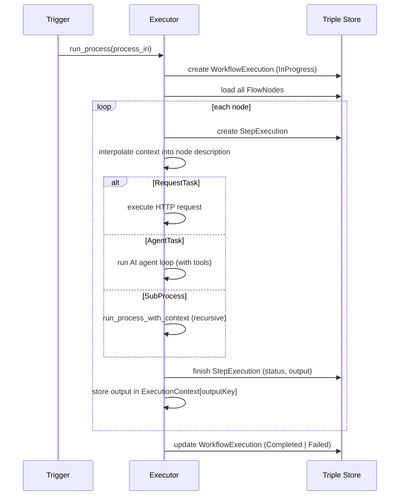

# Automation System

FOUNDATION includes a BPMN 2.0-based workflow engine that reacts to data changes, schedules tasks, and orchestrates multi-step processes — including AI-powered steps that can use any FOUNDATION tool.

## Table of Contents

- [Concepts](#concepts)
- [Process Structure](#process-structure)
- [Supported BPMN Elements](#supported-bpmn-elements)
- [Task Types](#task-types)
- [Trigger Mechanisms](#trigger-mechanisms)
- [Execution Flow](#execution-flow)
- [Connectors](#connectors)
- [AI Agent Tasks](#ai-agent-tasks)
- [Execution Context and Output Threading](#execution-context-and-output-threading)
- [Execution Tracking](#execution-tracking)
- [Key Source Files](#key-source-files)

---

## Concepts

A **Process** is a directed graph of **Flow Nodes** connected by **Sequence Flows**. When a process is triggered, the engine executes each node in sequence, passing outputs forward via a shared **Execution Context**. All processes, nodes, and flows are stored as RDF triples in the same database as all other FOUNDATION data.

Processes can be triggered in three ways:
- **Manually** — via the ProcessStatus widget or AI assistant
- **On a schedule** — via a cron expression on a TimerEventDefinition
- **Reactively** — when an internal event fires (e.g., entity created or updated)

---

## Process Structure

```
foundation:bpmn_Process
    ├── foundation:hasFlowNode →  StartEvent
    ├── foundation:hasFlowNode →  Task (one or more)
    ├── foundation:hasFlowNode →  EndEvent
    └── foundation:hasSequenceFlow → SequenceFlow (one per connection)
```

Each FlowNode has:
- `rdfs:label` — display name
- `rdfs:comment` — description (supports `{{key}}` template interpolation)
- `foundation:partOfProcess` — backlink to the parent process
- `foundation:outputKey` — (optional) context key under which the node's output is stored

---

## Supported BPMN Elements

| Element | IRI | Runtime behaviour |
|---------|-----|-------------------|
| Start Event | `foundation:bpmn_StartEvent` | ✅ Skipped via `continue` — correctly ignored |
| End Event | `foundation:bpmn_EndEvent` | ✅ Logs info message and skips via `continue` |
| Sequence Flow | `foundation:bpmn_SequenceFlow` | ✅ Used to define order; not dispatched as a node |
| Task | `foundation:bpmn_Task` | ⚠️ Falls through to catch-all — silently skipped, empty output |
| Request Task | `foundation:bpmn_RequestTask` | ✅ Fully implemented — executes HTTP call |
| Agent Task | `foundation:bpmn_AgentTask` | ✅ Fully implemented — runs AI agent loop with tools |
| User Task | `foundation:bpmn_UserTask` | ⚠️ Falls through to catch-all — silently skipped, empty output |
| Service Task | `foundation:bpmn_ServiceTask` | ⚠️ Stub — logs only, returns fake string `"output_of_{node_iri}"`, never calls AI |
| Script Task | `foundation:bpmn_ScriptTask` | ⚠️ Stub — same behaviour as Service Task |
| SubProcess | `foundation:bpmn_SubProcess` | ✅ Fully implemented — calls target process recursively |
| Exclusive Gateway | `foundation:bpmn_ExclusiveGateway` | ⚠️ Falls through to catch-all — silently skipped, all branches ignored |
| Inclusive Gateway | `foundation:bpmn_InclusiveGateway` | ⚠️ Falls through to catch-all — silently skipped |
| Parallel Gateway | `foundation:bpmn_ParallelGateway` | ⚠️ Falls through to catch-all — silently skipped |
| Timer Event Def | `foundation:bpmn_TimerEventDefinition` | ✅ Fully implemented — cron scheduling |
| Message Event Def | `foundation:bpmn_MessageEventDefinition` | ✅ Fully implemented — reactive event triggers |

---

## Task Types

### Request Task

Executes an HTTP call against an external service.

```
foundation:bpmn_RequestTask
    foundation:requestInputRefs → foundation:HTTPRequest
        foundation:httpUrl     "https://api.example.com/users/{{user_id}}"
        foundation:httpMethod  "POST"
        foundation:httpBody    "{\"name\": \"{{name}}\"}"
        foundation:httpHeaders "{\"Content-Type\": \"application/json\"}"
        foundation:usesCredential → foundation:APIKey_MyService
```

- URL and body support `{{key}}` template interpolation from the Execution Context.
- Credentials are resolved from the linked connector at execution time.
- The response body is stored as an `HTTPResponse` individual and returned as the step output.

### Agent Task

Runs an AI agent with access to all FOUNDATION tools. See [AI Agent Tasks](#ai-agent-tasks).

### Service Task / Script Task

> **⚠️ Stub — not implemented.** Both types are dispatched to `dispatch_ai_task()` in the executor, which loads the node label and description, logs them, and returns the string `"output_of_{node_iri}"` as output. No AI call is made. If a downstream step depends on the output key of a ServiceTask or ScriptTask, it will receive that literal fake string.

### User Task

Represents a step that requires human interaction. The process pauses until a user responds to the task's prompt.

```
foundation:bpmn_UserTask_Approve
    rdf:type                        foundation:bpmn_UserTask
    rdfs:label                      "Approve Invoice"
    foundation:assignedToUser   →   foundation:Person_JohnDoe   ← optional; omit to send to global inbox
    foundation:promptTemplate       "Please review invoice {{invoice_id}} and approve or reject it."
    foundation:responseSchema       "{\"decision\": \"approve|reject\", \"comment\": \"string\"}"
    foundation:outputKey            "approval_decision"
```

Properties:

| Property | Description |
|----------|-------------|
| `foundation:assignedToUser` | The person assigned to complete this task. If absent, the task appears in the global UserTask inbox for any user. |
| `foundation:promptTemplate` | The message or form presented to the user. Supports `{{key}}` interpolation from the Execution Context. |
| `foundation:responseSchema` | JSON schema describing the expected response structure. |

> **Status:** The ontology class and properties are fully defined. At runtime, the executor hits the catch-all branch (`_`) in `execute_nodes()`, logs a warning (`Skipping unhandled node type`), and returns `Ok("")` — the node is **silently skipped** and the process continues without waiting for any user input. `outputKey` will never be populated, so any downstream step that depends on `{{approval_decision}}` will receive an empty string.

### SubProcess

Calls another process, passing the current Execution Context forward. The child process can add its own outputs to the shared context.

```
foundation:bpmn_SubProcess
    foundation:calledElement → foundation:Process_OtherProcess
```

---

## Trigger Mechanisms

### Manual

Triggered by:
- The **ProcessStatus widget** "Run" button in the UI.
- The AI assistant via the `run_process` tool.
- Any Tauri-connected client via the `process__execute` command.

### Timer (Scheduled)

Attach a `foundation:bpmn_TimerEventDefinition` to the process's StartEvent:

```
foundation:bpmn_TimerEventDefinition_MyTimer
    rdf:type                       foundation:bpmn_TimerEventDefinition
    foundation:timerEventOf   →    foundation:StartEvent_MyProcess
    foundation:timeCycle           "0 9 * * 1-5"
```

The `timeCycle` value is a **5-field cron expression** (minute, hour, day-of-month, month, day-of-week):

| Field | Values |
|-------|--------|
| Minute | 0–59 |
| Hour | 0–23 |
| Day of month | 1–31 |
| Month | 1–12 |
| Day of week | 0–7 (0 and 7 = Sunday) |

Examples:
- `0 9 * * 1-5` — 9am on weekdays
- `*/15 * * * *` — every 15 minutes
- `0 0 1 * *` — midnight on the first of every month

The scheduler starts automatically at application launch and reloads whenever a `TimerEventDefinition` is created or updated.

### Reactive (Event-Driven)

Attach a `foundation:bpmn_MessageEventDefinition` to the StartEvent to fire the process whenever an internal event occurs:

```
foundation:EventType_EntityCreated
    foundation:eventKey    "entity-created"

foundation:bpmn_MessageEventDefinition_OnCreate
    rdf:type                          foundation:bpmn_MessageEventDefinition
    foundation:messageEventOf    →    foundation:StartEvent_MyProcess
    foundation:eventType         →    foundation:EventType_EntityCreated
```

Available internal event keys:

| Key | When it fires |
|-----|--------------|
| `entity-created` | Any new entity is created |
| `entity-updated` | Any existing entity is modified |

---

## Execution Flow



Execution stops immediately if any step fails. There are no retry or compensation mechanisms yet.

---

## Connectors

A **Connector** represents an external service integration. It defines authentication and base URL; individual HTTP calls are defined in the process as `HTTPRequest` entities that reference the connector's credential.

```
foundation:ExternalServiceConnector
    foundation:baseUrl        "https://api.example.com"
    foundation:authType       "apikey"          ← oauth2 | apikey | token | basic | imap
    foundation:hasCredential  → foundation:APIKey_MyService
    foundation:apiSpecUrl     "https://api.example.com/openapi.json"
    foundation:connectorVersion "1.0.0"
```

### Credential Types

| Auth Type | Credential Class | Properties |
|-----------|-----------------|------------|
| `apikey` | `foundation:APIKey` | `foundation:apiKeyValue` |
| `token` | `foundation:TokenCredential` | `foundation:tokenValue` |
| `basic` | `foundation:UsernamePasswordCredential` | `foundation:username`, `foundation:password` |
| `oauth2` | `foundation:TokenCredential` | `foundation:tokenValue` (access token) |
| `imap` | `foundation:UsernamePasswordCredential` | `foundation:username`, `foundation:password` |

Credentials are managed via the **ConnectorCredential widget** and can be exported/imported as JSON packages via the **ConnectorManager widget**.

---

## AI Agent Tasks

An **AgentTask** runs a full agentic loop: the AI receives the task description, executes tools, and loops until it produces a final text output.

```
foundation:bpmn_AgentTask_Analyze
    rdf:type                    foundation:bpmn_AgentTask
    rdfs:label                  "Analyze Report"
    rdfs:comment                "Read the report at {{report_url}} and summarize key risks"
    foundation:outputKey        "risk_summary"
    foundation:assignedAgent →  foundation:SoftwareAgent_Claude

foundation:SoftwareAgent_Claude
    foundation:usesService  →   foundation:ClaudeAPI
    foundation:usesModel        "claude-sonnet-4-6"
    foundation:basePrompt       "You are a process automation assistant."
    foundation:requestTimeout   60
```

The agent has access to all FOUNDATION tools during execution:

| Tool | Description |
|------|-------------|
| `assert_individual` | Create or update entity instances |
| `define_class` | Create or update ontology classes |
| `search` | Query entity instances |
| `describe_class` | Query ontology classes |
| `retract_individual` | Retract entity instances |
| `retract_class` | Retract ontology classes |
| `blackboard_update` | Add or remove widgets on the blackboard |
| `run_process` | Trigger another process (enables recursive orchestration) |

The agent loop runs up to 50 tool-call iterations before returning the final response as the step output.

---

## Execution Context and Output Threading

Each step can produce an output that subsequent steps can reference via `{{key}}` template syntax. The context is a key-value map that accumulates outputs as the process runs.

Example:

```
Step 1: RequestTask (outputKey: "user_data")
  → fetches user JSON, stores in context["user_data"]

Step 2: AgentTask (description: "Summarize this user profile: {{user_data}}")
  → description resolved to: "Summarize this user profile: {\"name\": \"Alice\", ...}"
  → outputKey: "summary"

Step 3: RequestTask (httpBody: "{\"text\": \"{{summary}}\"}")
  → body resolved with the AI's summary text
```

Template interpolation (`{{key}}`) is applied to:
- `rdfs:comment` (node description) — for all task types
- `foundation:httpUrl` — for Request Tasks
- `foundation:httpBody` — for Request Tasks

---

## Execution Tracking

Every process run creates a **WorkflowExecution** with a **StepExecution** per node, all stored as RDF individuals:

```
foundation:WorkflowExecution_abc123
    foundation:executesProcess  →  foundation:Process_MyProcess
    foundation:hasStatus        →  foundation:Completed
    foundation:hasStepExecutions → foundation:StepExecution_1
                                 → foundation:StepExecution_2

foundation:StepExecution_1
    foundation:executesStep     →  foundation:bpmn_RequestTask_Fetch
    foundation:belongsToExecution → foundation:WorkflowExecution_abc123
    foundation:hasStatus        →  foundation:Completed
    foundation:stepStartedAt       1741478400000
    foundation:stepFinishedAt      1741478401234
    foundation:outputValue         "foundation:HTTPResponse_xyz"
```

Failed steps record the error message in `foundation:stepError`. Because execution history is stored in the triple store, it can be queried, visualized, and audited like any other FOUNDATION data.

---

## Key Source Files

| File | Description |
|------|-------------|
| [src-tauri/src/process_automation/executor.rs](../src-tauri/src/process_automation/executor.rs) | Core execution engine |
| [src-tauri/src/process_automation/scheduler.rs](../src-tauri/src/process_automation/scheduler.rs) | Cron-based timer scheduling |
| [src-tauri/src/process_automation/trigger.rs](../src-tauri/src/process_automation/trigger.rs) | Reactive event-driven triggers |
| [src-tauri/src/process_automation/agent_task.rs](../src-tauri/src/process_automation/agent_task.rs) | AI agent task execution |
| [src-tauri/src/process_automation/request_task.rs](../src-tauri/src/process_automation/request_task.rs) | HTTP request execution |
| [src-tauri/src/commands/process_automation.rs](../src-tauri/src/commands/process_automation.rs) | Tauri command handlers |
| [src-tauri/src/commands/connector.rs](../src-tauri/src/commands/connector.rs) | Credential management |
| [src-tauri/src/commands/connector_package.rs](../src-tauri/src/commands/connector_package.rs) | Connector package export/import |
| [src/lib/components/widgets/ProcessStatusWidget.svelte](../src/lib/components/widgets/ProcessStatusWidget.svelte) | Process execution UI |
| [src/lib/components/widgets/ConnectorCredentialWidget.svelte](../src/lib/components/widgets/ConnectorCredentialWidget.svelte) | Credential configuration UI |
| [src/lib/components/widgets/ConnectorManagerWidget.svelte](../src/lib/components/widgets/ConnectorManagerWidget.svelte) | Connector package management UI |
