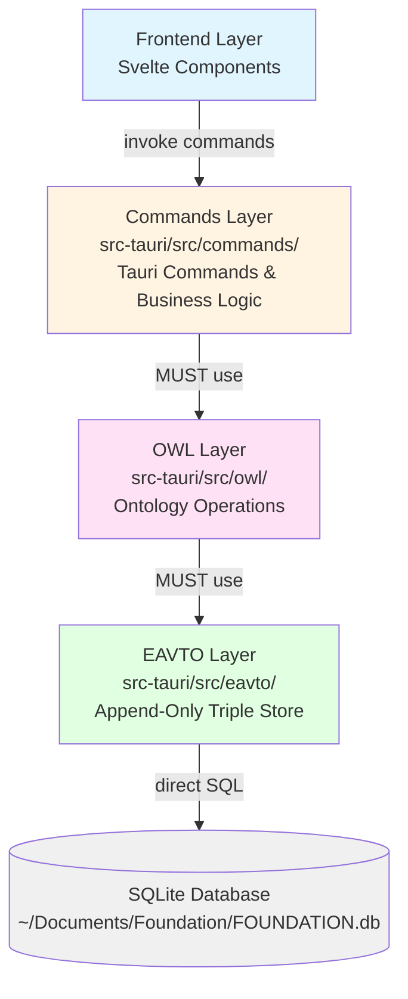

# Development Guide

## Running the Project

```bash
npm run tauri         # Start development server
npm run logs          # View recent application logs
npm run clear:chat    # Clear chat history
```

## Building Release Executables

```bash
# Build for current platform
npm run build:release

# Build for specific platforms
npm run tauri:build:mac      # macOS Universal (Apple Silicon + Intel)
npm run tauri:build:windows  # Windows x64
npm run tauri:build:linux    # Linux x64

# Or use the script
./scripts/build-release.sh
```

**Note**: To build for Windows and Linux from macOS, use GitHub Actions (push a tag like `v0.5.3`) or build on each platform natively.

## Important Paths

- **User Database**: `~/Documents/Foundation/FOUNDATION.db` - Main SQLite database with all user data
- **Application Logs**: `~/Library/Application Support/org.w3id.foundation/application.log` (macOS)
- **Core Ontology**: `core-ontology/*.ttl` - Base ontology definitions loaded on initialization

## Architecture Layers

FOUNDATION is organized in three distinct layers, each with clear responsibilities:



### 1. EAVTO Layer (`src-tauri/src/eavto/`)
The **foundation layer** that manages the append-only triple store database:
- **Responsibility**: Direct SQLite operations, triple storage and querying
- **Key principle**: Append-only semantics - queries return only the most recent values by default
- **API**: `query.rs` (read operations), `store.rs` (write operations)
- **Used by**: OWL layer only

### 2. OWL Layer (`src-tauri/src/owl/`)
The **ontology layer** that provides semantic understanding:
- **Responsibility**: OWL/RDFS operations (classes, properties, individuals)
- **Key principle**: All operations MUST use the EAVTO layer, never direct SQL access
- **API**: `Class`, `Property`, `Individual` structs with high-level operations
- **Used by**: Commands layer

### 3. Commands Layer (`src-tauri/src/commands/`)
The **application layer** that exposes functionality to the frontend:
- **Responsibility**: Tauri commands, business logic, API endpoints
- **Key principle**: All ontology operations MUST use the OWL layer
- **API**: Functions decorated with `#[tauri::command]`
- **Used by**: Frontend (Svelte components)

**CRITICAL**: Each layer must only use the layer below it. The OWL layer must never bypass EAVTO and access SQL directly, and commands must never bypass OWL to access EAVTO directly. This separation ensures maintainability and prevents issues like infinite recursion.

## Understanding the Ontology System

FOUNDATION uses **ontologies** to structure data semantically. Think of it as a smart schema that defines:
- **Classes** (types of things): `foundation:Person`, `foundation:Company`, `foundation:File`
- **Properties** (relationships): `foundation:worksFor`, `foundation:fileName`, `foundation:createdAt`
- **Individuals** (actual instances): `foundation:Person_123`, `foundation:File_456`

The ontology system provides:
- **Type validation**: Properties are checked against their defined domain/range
- **Inheritance**: Classes inherit properties from parent classes
- **Relationships**: Rich connections between entities (not just foreign keys)
- **Self-describing data**: The structure is stored in the same database as the data

The core ontology is embedded as `core-ontology/ontology.sql` and loaded at startup via `include_str!`. It defines all base classes, properties, and individuals across every domain (Message, File, Person, etc.).

## Debugging

Use `npm run logs` to check recent application logs. All frontend and backend errors are logged centrally.

### Database Structure

FOUNDATION stores all data in an **RDF triple store** using an append-only, immutable model:

**Core Table**: `triples`
```
subject | predicate | object | object_value | object_type | retracted
--------|-----------|--------|--------------|-------------|----------
foundation:Person_123 | rdf:type | foundation:Person | NULL | iri | 0
foundation:Person_123 | foundation:name | NULL | John Doe | literal | 0
foundation:Person_123 | foundation:worksFor | foundation:Company_456 | NULL | iri | 0
```

**Key Concepts**:
- **Subject-Predicate-Object** structure (RDF triples)
- **Immutable**: Data is never deleted, only marked as retracted (`retracted = 1`)
- **Dual storage**:
  - `object` column: IRIs and blank nodes (`object_type = 'iri'` or `'blank'`)
  - `object_value` column: Literal text values (`object_type = 'literal'`)
- **Optimized typed columns** (for performance):
  - `object_number`: For `xsd:decimal`, `xsd:double`, `xsd:float`
  - `object_integer`: For `xsd:integer`, `xsd:int`, `xsd:long`
  - `object_datetime`: For `xsd:dateTime` (Unix epoch milliseconds)
  - `object_boolean`: For `xsd:boolean` (0 = false, 1 = true)
- **Type tracking**: `object_datatype` stores the XSD datatype (e.g., `xsd:string`, `xsd:integer`, `xsd:dateTime`)
- **Audit trail**: Every change is timestamped and traceable via transactions

**Retraction Mechanism**:
- FOUNDATION uses an **append-only model** — data is never physically deleted
- Instead of `DELETE`, data is marked as retracted by inserting a new triple with `retracted = 1`
- This provides:
  - Complete history of all changes
  - Ability to query data "as of" any point in time
  - Undo/redo capabilities
  - Audit compliance
- **Always filter by `retracted = 0`** to get current (active) data
- To "delete" data: insert the same triple with `retracted = 1` and a new transaction ID

### Querying the Database

**Important:** The `triples` table has a specific structure for storing RDF data:
- **`object`** column: Contains IRIs/blank nodes (when `object_type = 'iri'` or `'blank'`)
- **`object_value`** column: Contains literal values (when `object_type = 'literal'`)
- **`retracted`** column: `0` = active, `1` = retracted (always filter by `retracted = 0`)

Always query **both columns** to get all data:

```bash
# ❌ WRONG - Will return empty for literal values
sqlite3 ~/Documents/Foundation/FOUNDATION.db "SELECT predicate, object FROM triples WHERE subject = 'foundation:File_123';"

# ✅ CORRECT - Returns both IRIs and literal values
sqlite3 ~/Documents/Foundation/FOUNDATION.db "SELECT predicate, object, object_value, object_type FROM triples WHERE subject = 'foundation:File_123' AND retracted = 0;"

# Get value regardless of type
sqlite3 ~/Documents/Foundation/FOUNDATION.db "SELECT predicate, COALESCE(object, object_value) as value FROM triples WHERE subject = 'foundation:File_123' AND retracted = 0;"
```

**Common Queries**:

```bash
# Find all instances of a class
sqlite3 ~/Documents/Foundation/FOUNDATION.db "
SELECT DISTINCT subject
FROM triples
WHERE predicate = 'rdf:type'
AND object = 'foundation:Person'
AND retracted = 0;"

# Find all properties of an individual
sqlite3 ~/Documents/Foundation/FOUNDATION.db "
SELECT predicate, COALESCE(object, object_value) as value
FROM triples
WHERE subject = 'foundation:Person_123'
AND retracted = 0;"

# Search for entities by property value
sqlite3 ~/Documents/Foundation/FOUNDATION.db "
SELECT subject
FROM triples
WHERE predicate = 'foundation:name'
AND object_value LIKE '%John%'
AND retracted = 0;"

# Get class definition (properties and their ranges)
sqlite3 ~/Documents/Foundation/FOUNDATION.db "
SELECT subject as property, COALESCE(object, object_value) as range
FROM triples
WHERE predicate = 'rdfs:domain'
AND object = 'foundation:Person'
AND retracted = 0;"
```
