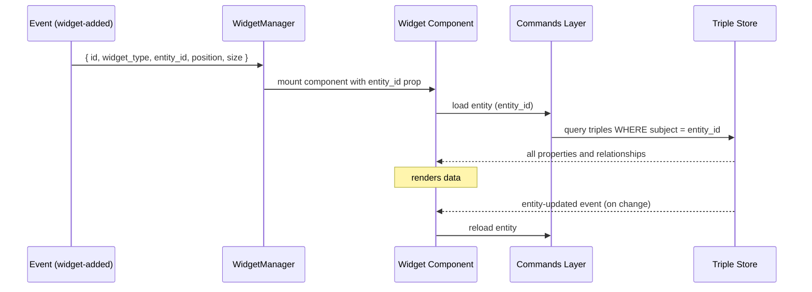

# Widget System

The **Dynamic Blackboard** is a visual canvas where multiple widgets display entities and their relationships simultaneously. Widgets are persistent — they survive restarts and are stored as RDF triples in the same database as all other data.

## Entity Binding

Every widget is bound to exactly one ontology entity via its `entity_id` (the entity's IRI). The widget reads all its display data directly from the entity's triples in the database and reacts to `entity-updated` events whenever the underlying data changes.

Widget IDs are **deterministic**: `foundation:Widget_{type}_{entity_id}`. This means you can never open two widgets of the same type for the same entity simultaneously — adding a widget that already exists is a no-op.

Each widget type declares whether it requires an entity binding through the `supports_entity` flag:

- `supports_entity: true` — the widget renders data from a specific entity (Inspector, Process Status, Connector widgets)
- `supports_entity: false` — the widget has its own content independent of any entity (Mermaid, when used standalone)

When a widget type is associated with a specific ontology class, it also declares `foundation:widgetDefSupportedConcepts`. This allows the UI and the AI to automatically suggest only the relevant widgets when the user selects an entity of a given type.

## Available Widget Types

| Widget | `widget_type` | Entity Binding | Description |
|--------|--------------|----------------|-------------|
| **Inspector** | `inspector` | Any entity | Displays all properties, relationships, backlinks, and child classes |
| **Mermaid** | `mermaid` | Any entity with `foundation:diagramSource` | Renders and edits Mermaid diagrams; writes changes back to the entity property |
| **Process Status** | `process_status` | `foundation:Process` | Shows real-time execution status and allows triggering the process |
| **Connector Credential** | `connector_credential` | `foundation:Connector` | Configures API keys, tokens, or username/password for an external service |
| **Connector Manager** | `connector_manager` | `foundation:Connector` | Exports and imports connector credential packages as JSON |

## Creating Widgets

There are three ways to add a widget to the blackboard:

**1. Automatically** — When a new entity is created, an `entity-created` event fires and `WidgetManager` opens an Inspector widget for it automatically.

**2. Via the UI** — Searching for an entity in the chat panel and selecting it opens a widget. The Inspector widget also shows available widget types for the current entity, allowing the user to open additional widgets directly.

**3. Via the AI** — The AI assistant can manage the blackboard using two tools:

```
blackboard_widgets_list(concept_iri?)
  → returns available widget types, optionally filtered by entity class

blackboard_update(operations)
  → accepts an array of operations: "add", "remove", or "replace"
```

Example `blackboard_update` call:
```json
[
  {
    "operation": "add",
    "widget_type": "mermaid",
    "params": { "entity_id": "foundation:Process_InvoiceApproval" }
  }
]
```

The `replace` operation clears the entire blackboard before adding a new widget — useful for the AI to switch context entirely.

## How a Widget Gets Its Data



Widgets never store entity data themselves — they always read from the triple store on demand. When the user edits content in a widget (e.g., a Mermaid diagram), the change is written back to the entity's property (`foundation:diagramSource`) via `widget__update_content`, keeping the entity as the single source of truth.

## Widget Storage Model

```
foundation:Widget_mermaid_Process_InvoiceApproval
    rdf:type                    foundation:Widget
    foundation:widgetType       "mermaid"
    foundation:widgetEntityId   foundation:Process_InvoiceApproval
    foundation:widgetPositionX  150
    foundation:widgetPositionY  100
    foundation:widgetSizeWidth  600
    foundation:widgetSizeHeight 500
```

## Implementing a New Widget Type

Adding a new widget type requires changes in three places.

### 1. Register the type in Rust

Add an entry to `widget__list_types()` in [src-tauri/src/commands/widget.rs](../src-tauri/src/commands/widget.rs):

```rust
WidgetType {
    id: "my_widget".to_string(),
    name: "My Widget".to_string(),
    description: "What this widget does".to_string(),
    supports_entity: true,  // false if it renders standalone content
},
```

### 2. Create the Svelte component

Create `src/lib/components/widgets/MyWidget.svelte`. The component receives two props and must follow the structure below:

```svelte
<script>
  import { onMount, onDestroy } from 'svelte';
  import { invoke } from '@tauri-apps/api/core';
  import { listen } from '@tauri-apps/api/event';

  let { widgetId, entityId = '' } = $props();

  let label = $state('');
  let unlistenEntityUpdated = null;

  async function loadData() {
    if (!entityId) return;
    const resultStr = await invoke('entity__get', { entityId });
    const data = JSON.parse(resultStr);
    label = data?.label ?? entityId;
    // read any other properties you need from data.properties
  }

  async function closeWidget() {
    await invoke('widget__remove', { widgetId });
  }

  onMount(async () => {
    await loadData();
    unlistenEntityUpdated = await listen('entity-updated', async (event) => {
      if (event.payload.entityId === entityId) await loadData();
    });
  });

  onDestroy(() => {
    if (unlistenEntityUpdated) unlistenEntityUpdated();
  });
</script>

<div class="my-widget">
  <!-- The .widget-header class is required — WidgetManager uses it for drag detection -->
  <div class="widget-header">
    <span>{label}</span>
    <button class="close-btn" onclick={closeWidget}>✕</button>
  </div>
  <div class="widget-content">
    <!-- widget body -->
  </div>
</div>
```

Two contracts must be respected:
- The root element must contain a child with class `widget-header` — `WidgetManager` attaches drag listeners to it.
- Call `invoke('widget__remove', { widgetId })` to let the widget close itself.

### 3. Register the component in WidgetManager

In [src/lib/components/widgets/WidgetManager.svelte](../src/lib/components/widgets/WidgetManager.svelte), add the import and a branch in the `{#each}` block:

```svelte
<!-- top of <script> -->
import MyWidget from './MyWidget.svelte';

<!-- inside the {#each widgets} block -->
{:else if widget.widget_type === 'my_widget'}
  <MyWidget widgetId={widget.id} entityId={widget.entity_id} />
```

### 4. Declare a WidgetDefinition in the ontology

Register a `foundation:WidgetDefinition` so the AI and the UI can discover the widget. Without this entry, `blackboard_widgets_list` will never return the widget and the AI will be unable to place it on the blackboard.

Use the `learn_things` MCP tool to register it:

```json
{
  "concept_iri": "foundation:WidgetDefinition",
  "label": "My Widget",
  "properties": [
    { "detail": "foundation:widgetDefId",               "value": "my_widget" },
    { "detail": "foundation:widgetDefDescription",      "value": "What this widget does" },
    { "detail": "foundation:widgetDefSupportsEntity",   "value": "true" },
    { "detail": "foundation:widgetDefSupportedConcepts","value": "foundation:MyClass" }
  ]
}
```

Omit `widgetDefSupportedConcepts` to make the widget available for any entity type.

## Frontend Components

```
src/lib/components/widgets/
├── WidgetManager.svelte              # Canvas: drag, z-index, viewport constraints
├── InspectorWidget.svelte            # Entity inspector
├── MermaidWidget.svelte              # Diagram editor with pan/zoom and fullscreen
├── ProcessStatusWidget.svelte        # Process execution and monitoring
├── ConnectorCredentialWidget.svelte  # Credential configuration
├── ConnectorManagerWidget.svelte     # Connector package import/export
└── inspector/
    ├── PropertyList.svelte           # Grouped property display
    ├── BacklinkList.svelte           # Entities referencing this entity
    ├── FilePreview.svelte            # Inline file preview
    └── MarkdownValue.svelte          # Markdown rendering
```
