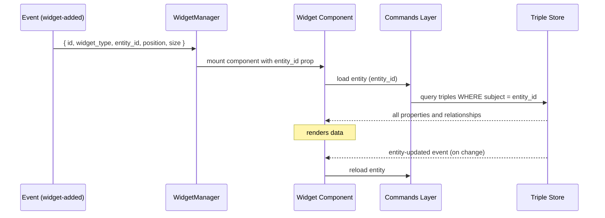

# Widget System

The **Dynamic Blackboard** is a visual canvas where multiple widgets display entities and their relationships simultaneously. Widgets are persistent — they survive restarts and are stored as RDF triples in the same database as all other data.

## Entity Binding

Every widget is bound to exactly one ontology entity via its `entity_id` (the entity's IRI). The widget reads all its display data directly from the entity's triples in the database and reacts to `entity-updated` events whenever the underlying data changes.

Widget IDs are **deterministic**: `foundation:Widget_{type}_{entity_id}`. This means you can never open two widgets of the same type for the same entity simultaneously — adding a widget that already exists is a no-op.

## Widget Type Registry

Widget types are defined as `foundation:WidgetType` individuals in the ontology — no Rust code changes are needed to register a new type. Each individual declares:

| Property | Type | Description |
|----------|------|-------------|
| `foundation:widgetTypeId` | `xsd:string` | Programmatic ID used in code (e.g. `"mermaid"`) |
| `foundation:widgetSupportedClass` | `xsd:string` | Entity class IRI this widget targets. `"owl:Thing"` means universal. |
| `foundation:widgetDefaultWidth` | `xsd:decimal` | Default width in pixels |
| `foundation:widgetDefaultHeight` | `xsd:decimal` | Default height in pixels |
| `foundation:widgetUsageNote` | `xsd:string` | *(optional)* AI creation instructions — presence marks this as AI-creatable |
| `rdfs:label` | literal | Display name shown in the UI |
| `rdfs:comment` | literal | Description shown as a tooltip |
| icon | — | Material Symbols icon name, used as the button icon in the Inspector header |

### How the frontend discovers widget types

The Inspector widget calls `widget_blackboard__list_widget_definitions(classIri)` on load, passing the current entity's class IRI. The backend queries all `foundation:WidgetType` individuals and returns those whose `widgetSupportedClass` matches the class IRI or is `owl:Thing` (universal). The Inspector header renders one icon button per result, using the widget's `icon` and `description` fields. Clicking a button calls `widget_blackboard__add_widget` with the corresponding `widgetTypeId`.

### Available widget types

| Widget | `widgetTypeId` | Supported Class | Description |
|--------|---------------|-----------------|-------------|
| **Inspector** | `inspector` | `owl:Thing` | Displays all properties, relationships, backlinks, and child classes |
| **Mermaid Diagram** | `mermaid` | `foundation:MermaidDiagram` | Renders a Mermaid diagram from the entity's `foundation:diagramSource` property |
| **Process Status** | `process_status` | `foundation:Process` | Shows real-time execution status and allows triggering the process |
| **Connector Credentials** | `connector_credential` | `foundation:Connector` | Configures API keys, tokens, or username/password for an external service |
| **Connector Manager** | `connector_manager` | `foundation:Connector` | Exports and imports connector credential packages as JSON |
| **Automation** | `automation` | `foundation:Automation` | Interactive SvelteFlow diagram of an Automation |
| **Workflow Execution** | `workflow_execution` | `foundation:WorkflowExecution` | Step-by-step details of a workflow execution run |
| **Graph** | `graph` | `foundation:GraphDiagram` | Force-directed graph of related entities; nodes are clickable for navigation |

## Creating Widgets

There are three ways to add a widget to the blackboard:

**1. Automatically** — When a new entity is created, an `entity-created` event fires and `WidgetManager` opens an Inspector widget for it automatically.

**2. Via the UI** — Searching for an entity in the chat panel and selecting it opens a widget. The Inspector widget also shows available widget types for the current entity, allowing the user to open additional widgets directly.

**3. Via the AI** — The AI passes entity IRIs in the `speak` tool's `iris` parameter. The system automatically selects the best widget type for each IRI based on its `rdf:type`, falling back to `inspector` if no class-specific widget matches.

```json
{
  "message": "Here is the invoice approval process.",
  "iris": ["foundation:Process_InvoiceApproval"]
}
```

### AI-creatable widgets

Some widget types require the AI to first create a dedicated entity before displaying it. These are marked with a `foundation:widgetUsageNote` in the ontology and are listed in the AI system prompt automatically.

| Widget | Required entity class | How |
|--------|-----------------------|-----|
| **Mermaid** | `foundation:MermaidDiagram` | Create the individual, set `foundation:diagramSource` to valid Mermaid syntax, then pass its IRI in `speak.iris` |
| **Graph** | `foundation:GraphDiagram` | Create the individual, add `foundation:graphEntities` pointing to the entities to include, then pass its IRI in `speak.iris` |

## How a Widget Gets Its Data



Widgets never store entity data themselves — they always read from the triple store on demand.

## Widget Storage Model

```
foundation:Widget_mermaid_MermaidDiagram_InvoiceFlow
    rdf:type                    foundation:Widget
    foundation:widgetType       "mermaid"
    foundation:widgetEntityId   foundation:MermaidDiagram_InvoiceFlow
    foundation:widgetPositionX  150
    foundation:widgetPositionY  100
    foundation:widgetSizeWidth  700
    foundation:widgetSizeHeight 500
```

## Implementing, changing, or removing a widget type

The end-to-end recipes — including handler scaffolding, the `WidgetManager` dispatch wiring, and the ontology call to register a `foundation:WidgetType` — live as Claude Code skills under [.claude/skills/](../.claude/skills/):

- [widget-create](../.claude/skills/widget-create/SKILL.md) — adds a new widget type
- [widget-change](../.claude/skills/widget-change/SKILL.md) — alters metadata or component logic of an existing widget
- [widget-remove](../.claude/skills/widget-remove/SKILL.md) — retracts a widget type and cleans up dispatch + component file

The skills are the source of truth for the workflow. The contracts every component must respect are unchanged:
- The root element must contain a child with class `widget-header` — `WidgetManager` attaches drag listeners to it.
- Call `invoke('widget_blackboard__remove_widget', { widgetId })` to let the widget close itself.

## Frontend Components

```
src/lib/components/widgets/
├── WidgetManager.svelte              # Canvas: drag, z-index, viewport constraints
├── WidgetContainer.svelte            # Shared chrome: header, resize, window state
├── InspectorWidget.svelte            # Entity inspector
├── MermaidWidget.svelte              # Diagram editor with pan/zoom and fullscreen
├── ProcessStatusWidget.svelte        # Process execution and monitoring
├── ConnectorCredentialWidget.svelte  # Credential configuration
├── ConnectorManagerWidget.svelte     # Connector package import/export
├── AutomationWidget.svelte           # SvelteFlow diagram for Automation
├── WorkflowExecutionWidget.svelte    # Workflow execution step viewer
├── GraphWidget.svelte                # Force-directed graph
├── inspector/
│   ├── PropertyList.svelte           # Grouped property display
│   ├── BacklinkList.svelte           # Entities referencing this entity
│   ├── FilePreview.svelte            # Inline file preview
│   └── MarkdownValue.svelte          # Markdown rendering
└── automation/                       # Node components for AutomationWidget
    ├── layout.js                     # Dagre layout engine
    ├── StatusBadge.svelte            # Status indicator
    └── Node*.svelte                  # One file per node type (9 types)
```
